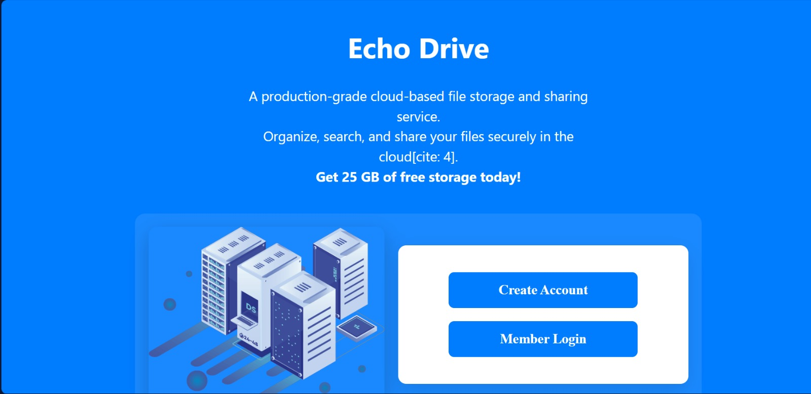
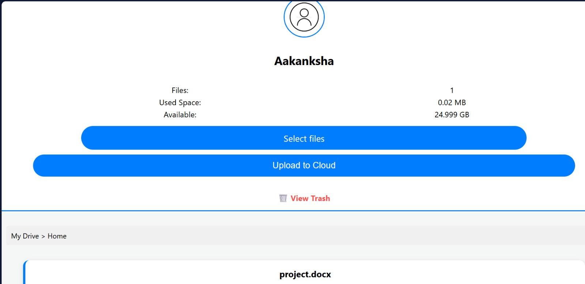

# ☁️ Echo Drive - Full Stack Cloud Storage

Echo Drive is a production-grade personal cloud storage solution. It provides a seamless, responsive interface for users to upload, manage, and retrieve files securely. Built with a focus on modern UX and robust backend architecture, Echo Drive leverages the power of Supabase for real-time authentication and cloud scaling.

---

## ✨ Key Features

* **Secure Authentication**: Integrated with Supabase Auth for high-security login and registration flows.
* **Real-time Dashboard**: A personalized view showing total file counts, used storage, and available space in real-time.
* **Responsive UI/UX**: Optimized for both Desktop and Mobile views with custom CSS breakpoints.
* **Smart Upload Feedback**: Visual status updates (e.g., "Uploading 3 files...") to keep users informed.
* **Cloud Integrity**: Files are stored in Supabase Storage buckets, ensuring high availability and encrypted transfers.
* **Trash System**: Soft-delete functionality allowing users to manage a recovery bin before permanent removal.

---
## 📸 Screenshots

### 1. Authentication Page
The landing page for secure login and account creation.



### 2. User Dashboard
The main interface showing the file list and storage management tools.



## 🛠️ Tech Stack

| Layer | Technology |
| :--- | :--- |
| **Frontend** | HTML5, CSS3, JavaScript (ES6+) |
| **Backend** | Python (Flask) |
| **Database** | PostgreSQL (via Supabase) |
| **Storage** | Supabase Storage Buckets |
| **Auth** | Supabase Auth (JWT) |
| **Deployment** | Render / Gunicorn |


## ⚙️ Installation & Setup

### 1. Clone the repository
```bash
git clone https://github.com/aakankshabadgujar/EchoDrive.git
cd EchoDrive

```

### 2. Install Dependencies

```bash
pip install -r requirements.txt

```

### 3. Environment Variables

Create a file named **.env** in the root directory and add your Supabase credentials:

```env
SUPABASE_URL=your_supabase_project_url
SUPABASE_KEY=your_supabase_anon_key

```

### 4. Database Configuration

Ensure your PostgreSQL tables (`users` and `files`) are set up in the Supabase SQL editor with the following columns:

**Users Table:**

* `id` (Primary Key)
* `email`
* `name`

**Files Table:**

* `id` (Primary Key)
* `name`
* `size`
* `storage_path`
* `owner_id` (Foreign Key to Users)
* `is_deleted` (Boolean, default: **false**)

### 5. Run Locally

```bash
python app.py

```

---

## 🛡️ Database Schema

The project uses a structured relational schema to track user metadata and file properties.

* **Users Table**: Tracks unique IDs, names, and emails used for authentication and personalization.
* **Files Table**: Tracks filenames, sizes, storage paths in the bucket, and soft-delete states (`is_deleted`).

---

## 🚀 Deployment

This project is optimized for deployment on **Render**.

1. **Push your code**: Ensure all files (app.py, requirements.txt, etc.) are in the **root** of the repository, not in a subfolder.
2. **Create Web Service**: Connect your GitHub repo to a new Render Web Service.
3. **Configure Environment**: Add `SUPABASE_URL` and `SUPABASE_KEY` as Environment Variables in the Render dashboard.
4. **Start Command**:

```bash
gunicorn app:app

```

---

## 📜 License

Distributed under the **MIT License**.

---

**Developed by Aakanksha Badgujar**


